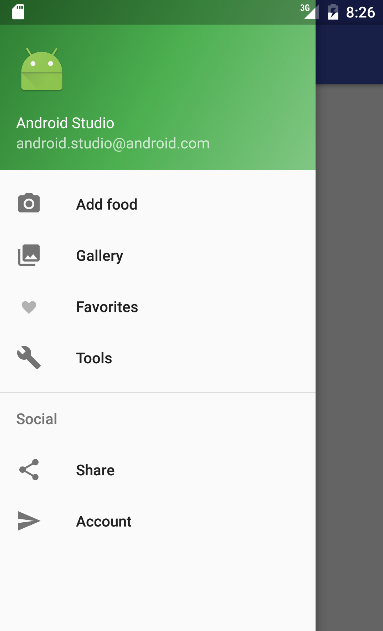

# Process book

# Day 1
Think of a great app.. wrote an initial proposal. 

# Day 2
Thinking over my idea and base features. Setting up a programming environment.  
Researching technical difficulties, need to set up online database (for free).

# Day 3
Made some basic activities, experimenting with different types of navigation. Also looking into Parse.com for setting up database.

# Day 4
Started experimenting with Parse. Decided to go with a navigation drawer (side bar), trying to make it work smoothly.  
Replaced activities with fragment, app now has 1 activity which shows 1 fragment at the time.

# Day 5
Navigation bar seems to work smoothly now, added animations to fragment transitions. Started connecting to Parse.com for user login/sign up.

# Day 6
Set up database classes. I love parse.com, the login/registration was very simple to implement! Clear documentation and tutorials aswel.

# Day 7
Connect parse class to my app's java class, made a basic 'new recipe' feature without image which gets uploaded to Parse.

# Day 8
Can retrieve and show a list of recipes now from Parse, made Gallery fragment with a listview that shows all public recipes. 
Setting up adapter etc..

# Day 9
Struggles with the upload image feature (from camera and gallery), image preview seems to disappear on screen rotation..

# Day 10
Uploading images seems to work now, from camera and from device. Still trying to find a way to keep the image when the screen rotates..

# Day 11
Managed to get image displays working, had to include an extra parse library (ParseUI) to use ParseImageView. Created DetailsFragment so users can view recipe details now.

# Day 12
Started working on the ability to add user specific favorites, some minor troubles deleting favorites but eventually got it working..

# Day 13
Fixing lots of bugs.. Trying to reorganize the app's data flow for app performance. I should not query the favorites for every recipe. Refactored to query to Parse once, and then check if a recipe id is contained in a list of favorite recipe id's.

# Day 14
Implemented a way to edit or delete existing recipes, but only by it's current author. I used the actionbar buttons for this, they will only show if the user owns the recipe. Also went ahead and worked on the styling a little bit.

# Day 15
Started implementing the rating system, this is actually a lot more work than I thought. Every signed up user should be able to rate once (between 1 and 5), but also be able to adjust their previous rating.

# Day 16
More work on the rating system, I have a seperate rating table which I need to query for every recipe now.. Feels very inefficient. I will add extra columns to the Recipe table, totalRating and numberOfRatings. This way I can always calculate an average rating with only a recipe row.

# Day 17
Ratings fully implemented and working (I hope). No more time to work on a comments feature so I will mark this as my beta. 
Refactor code, update all code documentation.

# Day 18
Updating readme, started working on final report, making final sketches / screenshots

# Day 19 
Report..

# Day 20
Presentation day
