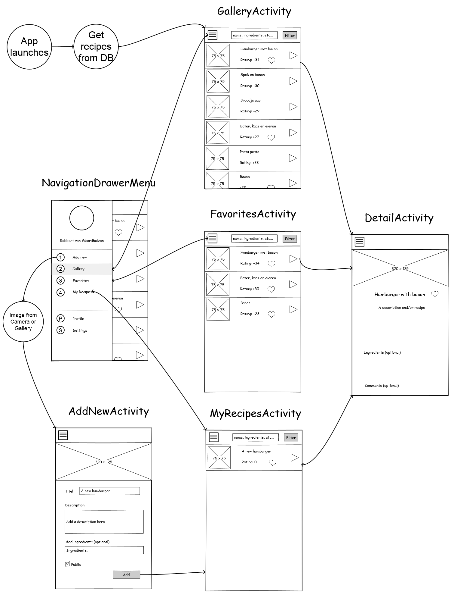

# Programmeer project UvA
I propose to build an application that is purely about food, and combines it with social aspects.  
With this app, users can view public recipes from this "social food network" anytime.  
If they wish to take part of the network themselves, they may chose to sign up for an account.  
This way users are allowed to upload their own recipes, take a photo, and add a description.  
I hope to inspire people to eat new things with this app, fill the gap in their stomachs.

# Features

- Database with recipes from the community at your disposal
- Store your favorite recipes
- Create an account, rate and comment on recipes.
- Add your own recipes
  - Upload a photo, add a description.
  - Make them public, or keep them private.
  - Optional: tag a restaurant/location
  
# Sketches

# Data, Parts & API's
After some discussion with the teacher I have decided to NOT focus on implementing a recipe API. Instead I will focus on the part that makes my app unique, which is the social feature in combination with a food platform. Therefore I shall first take care of logging in an signing up users, then adding and displaying recipes. I will also try to get the comments feature working before I look into the possibilities of connecting my app to an existing recipe API.
  
As for my database I will at least require these tables: 
- User
  - Id
  - Username
  - Password

- Recipe
  - Id
  - Title
  - Description
  - Ingredients (?)
  - Image

- Favorite
  - Id
  - UserId
  - RecipeId
  
- Comment
  - Id
  - UserId
  - RecipeId
  - Message
  
# Potential problems

Building a social platform might be time consuming, I must focus on the most important features first. Connecting the different parts later might be tricky.

# Similair apps
There are a lot of food rating apps, design wise I think youTube app is a great example of the UI i intend to build.

Feature-wise I think the Albert Heijn app (Appie) comes pretty close. I think the main difference between this app and mine is the social aspect and being community based.

