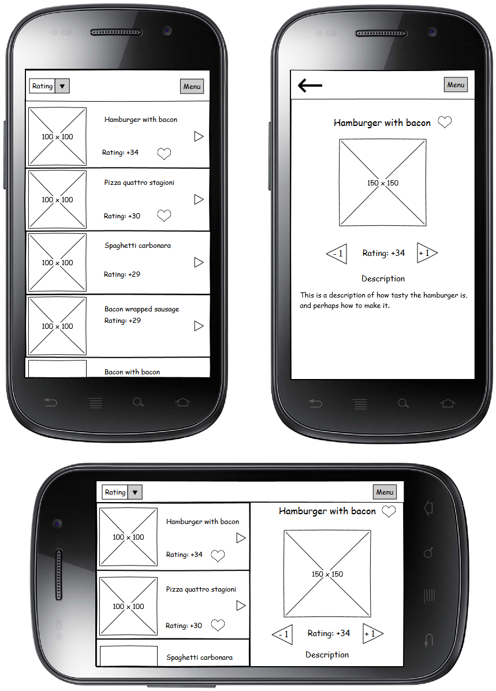

# programmeer project UvA

Ik stel voor om een applicatie voor Android te maken waarbij alles draait om voedsel.  
Met deze app kunnen gebruikers etenswaar bekijken, beoordelen en/of toevoegen.  
Ik hoop op deze manier gebruikers inspirate te geven om eens iets nieuws te eten.

# Features

- Database met gerechten tot je beschikking (online?)
- Favoriete eten opslaan
- Maak een account, geef commentaar
- Voeg zelf gerechten toe
  - upload een foto en een beschrijving
  - optioneel: recepten
  - optioneel: tag een restaurant/locatie
 
# Sketches

# Data, onderdelen & API's

Er zal een database moeten worden aangemaakt, met tenminste 3 tabellen; gebruikers, gerechten en commentaar 
Deze database zou door gebruikers moeten aangevuld worden, vorm van registratie lijkt me noodzakelijk.  
Ik hoop dit met sqlite / mysql voor elkaar te krijgen aangezien android dit implementeert, en de data met een online server te synchroniseren.

# Potential problems

Een goede database structuur lijkt me erg belangrijk, vooral als er ook afbeeldingen moeten worden opgeslagen.  
Ik denk dat het grootste gevaar is dat ik te veel features wil maken in een te korte tijd. Prioriteiten stellen is belangrijk in zo'n korte periode, en eerst een feature afwerken voor ik aan de volgende begin.

# Soortgelijke apps
Er zijn een aantal soortgelijke apps, de meeste gebasseerd op restaurant beoordelingen. Ik denk dat mijn app verschilt omdat het niet commercieel gericht is, en simplistisch blijft. Hierdoor kun je makkelijk en snel een lijst met je favoriete voedsel bijhouden.

