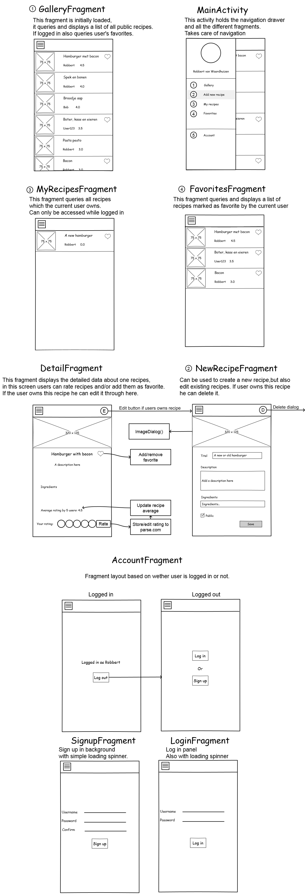
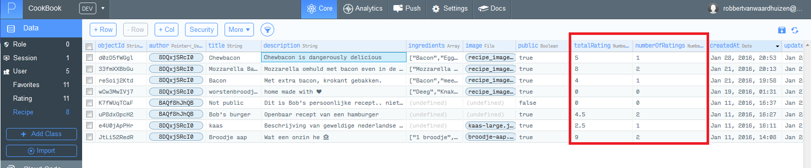
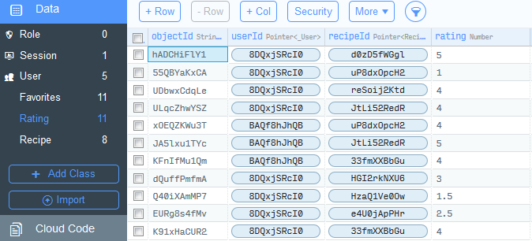

# Cookbook

## Description
Cookbook is an app that is all about food, combined with a social platform. Anyone with this app can view the recipes that the community has uploaded publicly.
To make use of storing favorites and rating other recipes, users must create an account. With a (free) account users may add their own recipes to Cookbook, which in their turn can be rated and stored as favorite. This app is mainly focused on this social aspect of adding and rating public recipes. Future releases will include a commenting feature, and extended account options.

## Features

- Database with recipes from the community at your disposal
- Create an account to..
  - Store favorites online
  - Rate recipes
  - Add your own recipes
    - Upload a photo, add a description and/or ingredients.
    - Make them public, or keep them private.

## Technical design

The goal of this project building an online platform where users may upload recipes and rate others. To achieve this in the first place I will require some sort of registration and log in. Parse.com makes this very easy and has saved me a lot of time on this aspect. 
To thoroughly explain the different parts of my code I have drawn a sketch of how the different screens work. 
All screen titles can be found as Java files in my project, translating what the code is supposed to do.  
To make this work I have used one Activity, which holds the navigation drawer and handles the fragment transitions.  

## Challenges and changes
Overal it was a very intense period to build a solid app in 20 days. During the first week I was still mainly thinking over my MVP base features. At the end of the week (after some feedback on friday) I've decided to skip using a recipe API to retrieve a list of known recipes. Instead I started focussing on a social platform where all recipes were added by the community. This was very helpful feedback because time was already short, and gave my project more focus.    

Parse.com was a very helpful tip aswel, as I first thought about implementing a native android SQLite database. Parse made things very simple, especially implementing a registration and login feature was effortless. Thanks to clear documentation and tutorials I was able to learn the Parse syntax quite quickly, which helped me build features faster. Big thanks to them. 
 
The biggest challenge that eventually arose was implementing the rating system. The rating system was the last feature my MVP needed to have some sort of community interraction. But before ratings could be implemented I had to finish the other features (account, adding recipes, showing recipes, editing recipes).  
Instead of +1 or -1 ratings I later decided to go with a scale of 1-5, adding a fancy cookie ratingbar (cookies go well with cookbook). This however means that the recipe rating is the average of all these ratings. This caused some struggles at first because I was sending a new query to the Parse 'Rating' table for every recipe to calculate the average rating, which led to performance issues. Instead I added 2 columns to the Recipe table: totalRating and amountOfRatings. This way I could always easily calculate the average rating of a recipe by dividing the totalRating by amountOfRatings, if these were kept up to date. 

To achieve this I had to make use of the Parse .increment feature, where every new rating would increment numberOfRatings, and every existing rating adapted properly. To keep track of every individual rating I had already made the Rating table in Parse: 

 
My app only works online, syncing between online and local datastore was too much of a challenge. I have looked into the possibilities, and did experimet with it, but eventually could not get it working. Also I did not have enough time left to build a commenting system, or more detailed account settings (like a picture, google+ sign in).  

