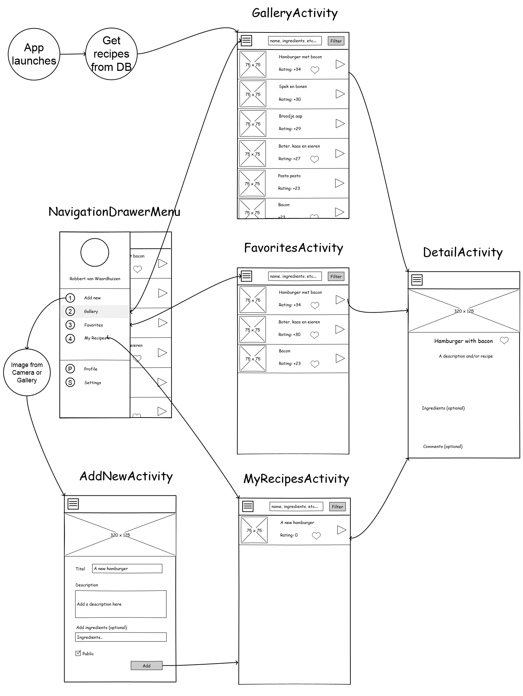

# Design Document
## MVP
The Minimal Viable Product is an app which displays a list of recipes added by users.  
To achieve this users must be able to create an account and log in, and be able to upload their own recipes.  
I will use Parse.com to maintain an online database and keep track of users, recipes and ratings.  

## Sketch
This sketch contains most of the activities I want to create, apart from a login/signup form.

## API
After some feedback from the teacher I have decided not to implement an API to retrieve recipes. Instead this app will rely on the community to add recipes instead.

## Data
For the MVP I will atleast need to get the api working. If I want users to be able to add their own recipes publicly, I need to set up my own database. I will need the following tables:
- Recipe
  - titel
  - image
  - description
  - ingredients
  - totalRating
  - numberOfRatings (to calculate average)

- User (Parse.com standard user table, no e-mail verification)
  - username
  - password

- Rating
  - fromUser
  - onRecipe
  - rating
